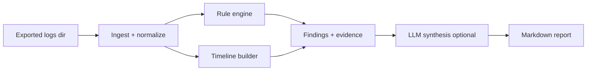

# eks-log-analyzer

SRE-grade analysis for **exported logs from a troubled Amazon EKS node**.

Point it at a directory of exported logs (kubelet, containerd, aws-node/VPC CNI,
kube-proxy, dmesg, `messages`/journal, pod logs, `kubectl describe`/events dumps)
and it produces:

1. **Deterministic findings** from a signature rulebook — always works, **no API key required**.
2. A **correlated timeline** of notable events (expanded in Phase 2).
3. *(Phase 3, optional)* **LLM synthesis** that ranks root-cause hypotheses and proposes fixes — with evidence citations.

> **Design principle:** rules find facts; the LLM explains and prioritizes.
> The LLM is never the only source of a finding.

## Status

- ✅ **Phase 1:** ingest, normalize, rule engine (12 signatures), Typer CLI, Rich output, tests.
- ✅ **Phase 2:** correlated timeline, Markdown report (`--report`), incident-window filters (`--window-start`/`--window-end`).
- ✅ **Phase 3 (this release):** redaction layer + optional OpenRouter LLM synthesis (`--llm`), with map-reduce for large inputs and evidence-cited output.

## Architecture



| Stage | Responsibility |
|-------|----------------|
| **Ingest** | Walk directory; detect file type; assign a `source` tag. |
| **Normalize** | Parse timestamps to UTC where possible; emit `LogEvent` records. |
| **Rules** | Match YAML signatures; emit `Finding` with id, severity, evidence. |
| **Timeline** | Order notable events cross-source; mark the first signal; optional incident-window filter. |
| **Report** | Markdown: Summary, Timeline, Findings (with `file:line` evidence), Suggested checks. |
| **LLM** | Optional, redacted, OpenAI-compatible (OpenRouter); ranks hypotheses and cites findings. |

## Install

Requires **Python 3.12+**. Using [`uv`](https://docs.astral.sh/uv/) (recommended):

```bash
uv sync
```

Or with pip:

```bash
python -m venv .venv && source .venv/bin/activate   # Windows: .venv\Scripts\activate
pip install -e ".[dev]"
```

## Usage

```bash
# Rules + timeline summary in the terminal (offline, no key)
uv run eks-log-analyzer analyze ./exports/node-1/

# Write a full Markdown report
uv run eks-log-analyzer analyze ./exports/node-1/ --report out.md

# Focus on an incident window (ISO-8601; naive times are treated as UTC)
uv run eks-log-analyzer analyze ./exports/node-1/ \
  --window-start 2024-05-01T12:00:00Z --window-end 2024-05-01T12:05:00Z

# Use a custom rulebook
uv run eks-log-analyzer analyze ./exports/node-1/ --rulebook config/eks-signatures.yaml

# List all signature ids
uv run eks-log-analyzer rules list
```

Enable optional LLM synthesis (ranked hypotheses, confirmatory checks, fixes):

```bash
# Put your key in .env (gitignored): OPENROUTER_API_KEY=sk-or-v1-...
cp .env.example .env

uv run eks-log-analyzer analyze ./exports/node-1/ --llm --report out.md
```

If the key is missing, `--llm` prints a warning and the tool continues with
offline analysis only (exit code 0). The model is configured in
`config/config.yaml` (copy from `config/config.example.yaml`) and is swappable.

Try it against the bundled synthetic export (a rendered report lives at
[`examples/sample-report.md`](examples/sample-report.md)):

```bash
uv run eks-log-analyzer analyze tests/fixtures/sample-export/ --report out.md
```

> **Timestamps & year inference:** klog (`I0501 …`) and syslog (`May  1 …`) lines
> omit the year. The analyzer anchors them to the year of the first full-date
> timestamp found in the dataset, so the timeline stays coherent.

## Signatures

The rulebook lives in `config/eks-signatures.yaml`. Phase 1 ships 12 signatures
covering VPC CNI IP exhaustion, aws-node/IPAMD failures, kubelet PLEG, disk/memory
pressure, container OOMKills, image-pull failures, DNS, TLS/x509, IRSA/OIDC,
AWS API throttling, and EBS CSI mount failures. Add your own by appending entries:

```yaml
signatures:
  - id: my-rule
    title: Short summary
    severity: high            # critical | high | medium | low
    sources: [kubelet]        # optional source filter
    patterns:                 # case-insensitive regexes; any match -> finding
      - "some error string"
    description: What it means.
    hints:
      - "What to check next."
```

## Development

```bash
uv run pytest        # run the test suite
uv run ruff check .  # lint
```

## Privacy & secrets

- Offline analysis (the default) sends **nothing** anywhere.
- `.env`, `config/config.yaml`, and real log exports are **gitignored**.
- Fixtures under `tests/fixtures/` are **synthetic** (no real customer/account data).
- `llm.py` is the **only** module that makes network calls, and **all** outbound
  text is passed through `redact.py` first.

### What is sent to the model (only with `--llm`)

A single prompt (or, for large inputs, several map-reduce shards) containing:

- A header line with the log directory path and file/event counts.
- The **deterministic findings**: id, severity, title, description, and up to a
  few **redacted** evidence lines each (with `file:line` refs).
- The **timeline** of notable events (redacted text).

Before sending, `redact.py` scrubs (each toggleable in `config.yaml` under
`redact:`):

| Category | Replaced with | Examples |
|----------|---------------|----------|
| IPv4 / IPv6 | `<IP>` | `10.100.0.1` |
| AWS account IDs (12-digit) | `<ACCOUNT_ID>` | `123456789012` |
| ARNs | `<ARN>` | `arn:aws:iam::…:role/…` |
| Credentials / tokens | `<TOKEN>` | `Bearer …`, `AKIA…`, `sk-…`, JWTs |
| Emails | `<EMAIL>` | `oncall@example.com` |

The CLI prints a one-line summary of how many items were redacted before each
run. Redaction is conservative and ordered (ARNs and tokens before generic
account-id/IP patterns) and leaves timestamps and version strings untouched.

The LLM is asked to **explain and prioritize** the deterministic findings — it
must cite finding ids or quoted log lines and must not invent findings.

## License

MIT.
